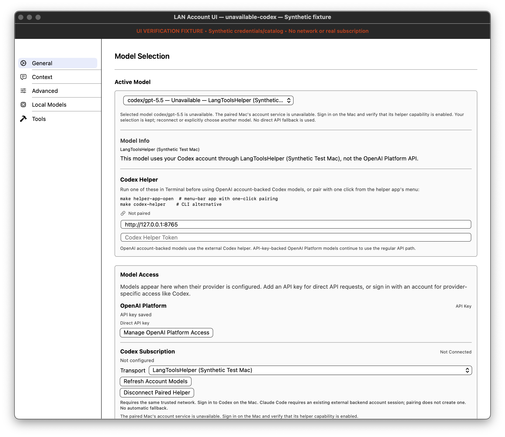
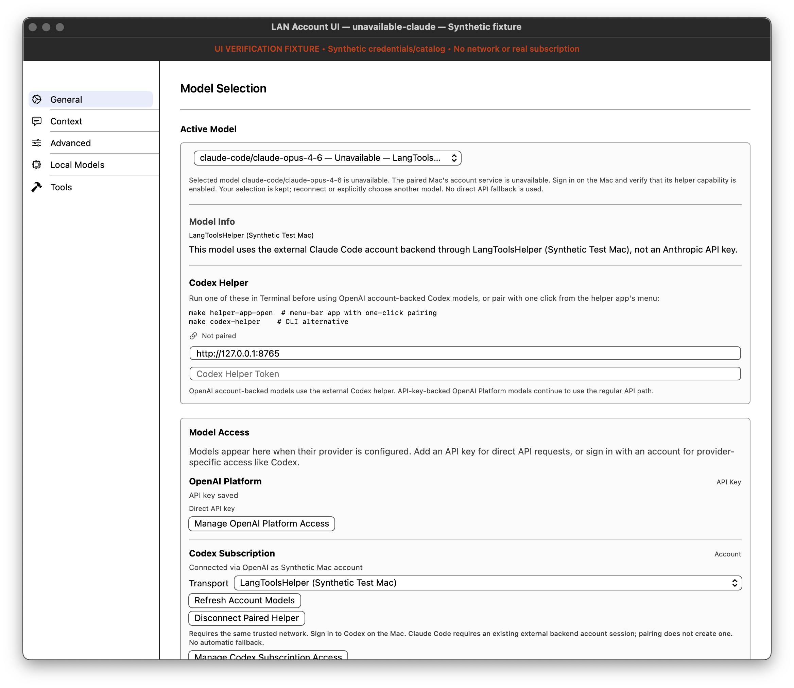
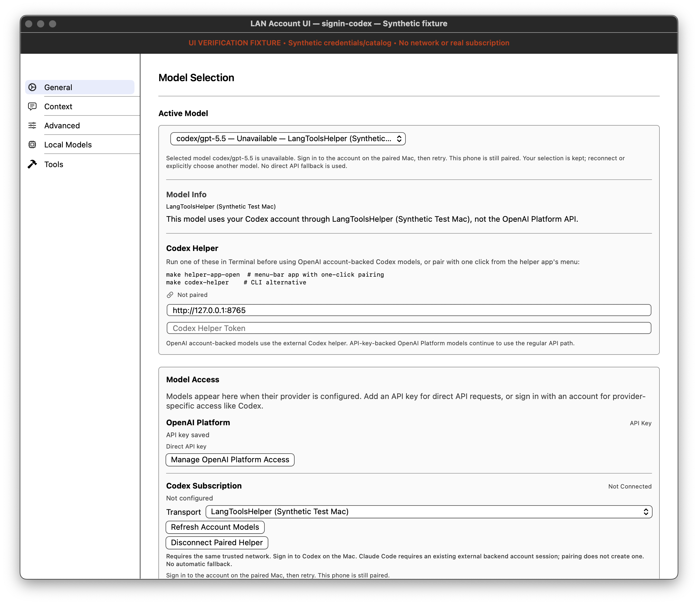
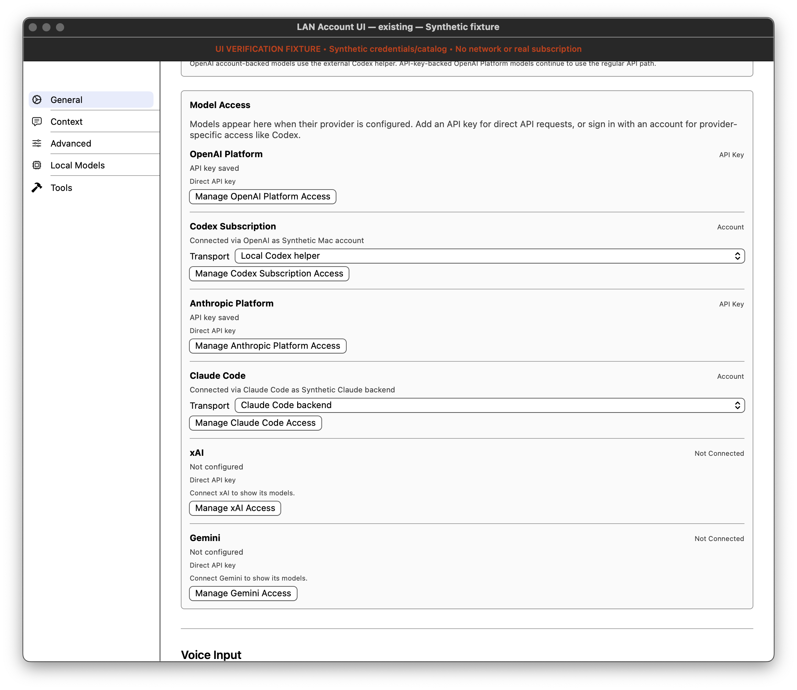
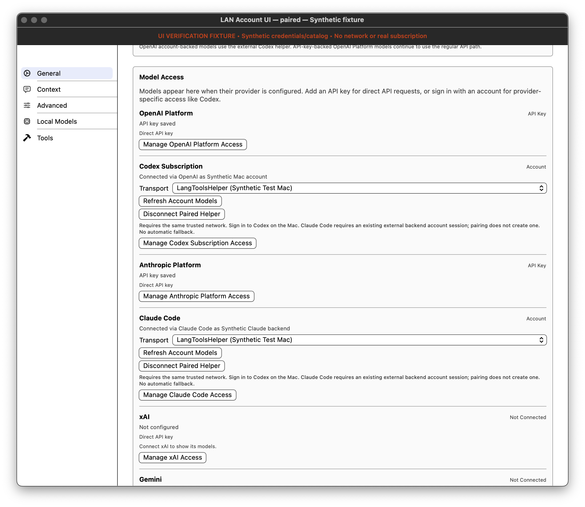
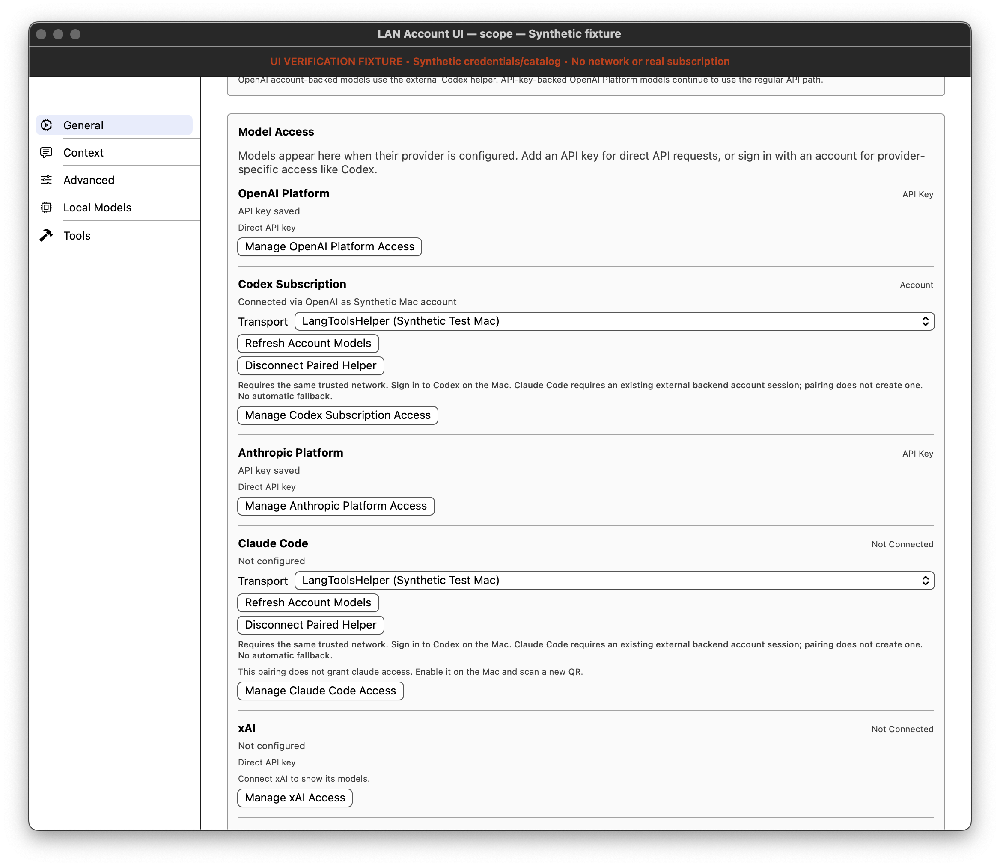
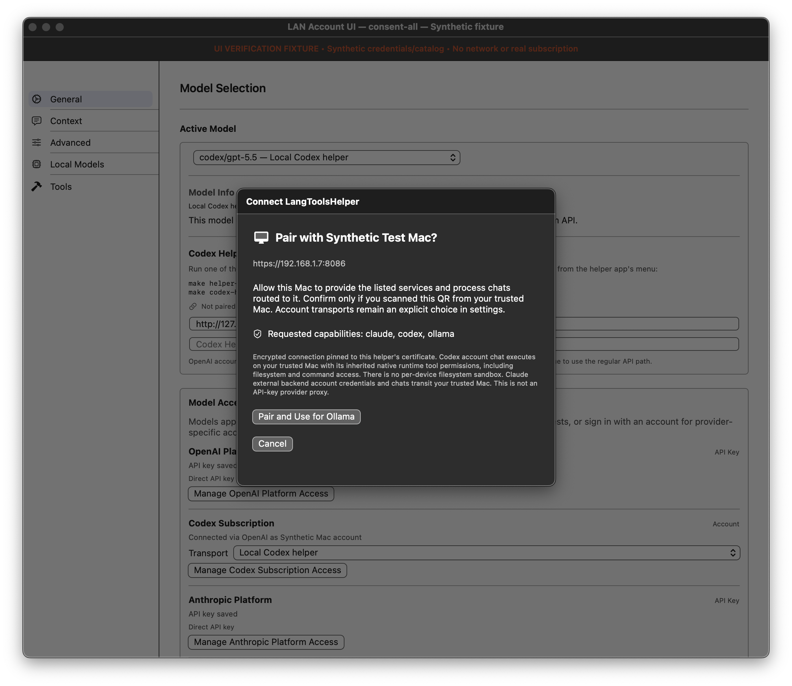
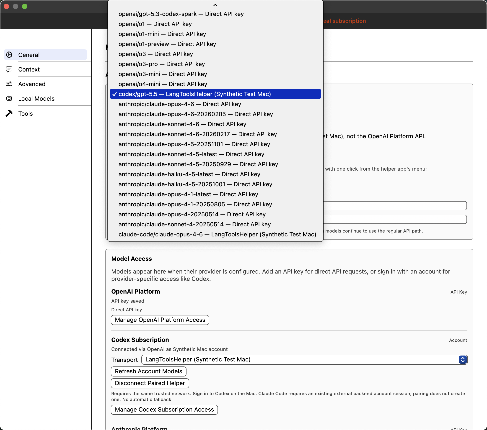
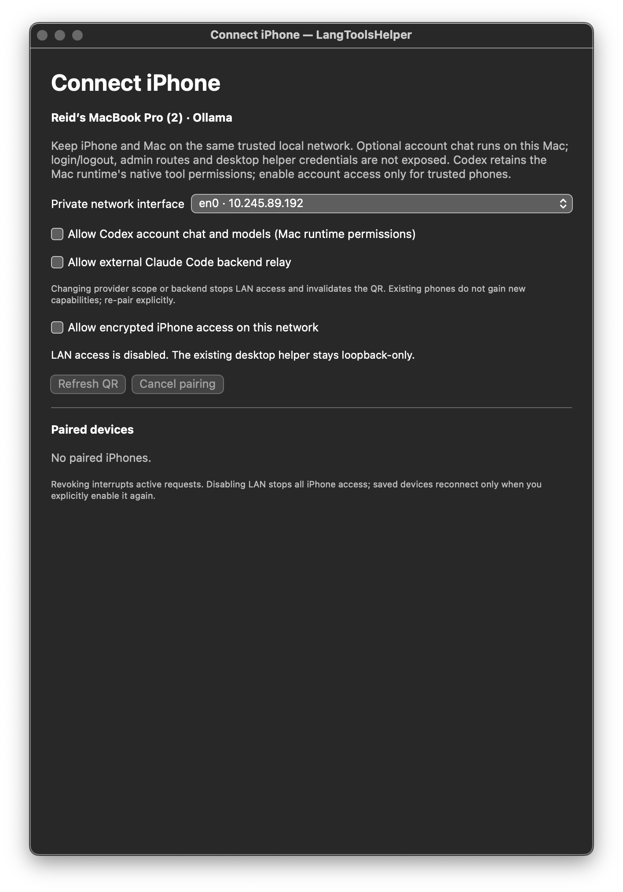
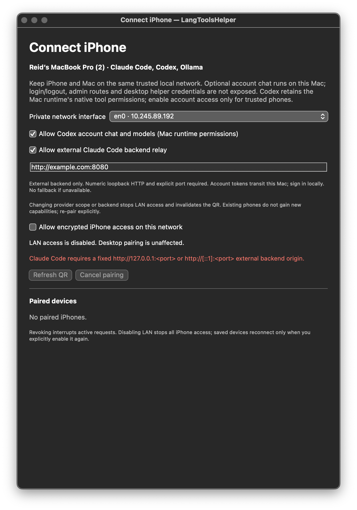

# LangToolsHelper LAN account routing

## Scope and setup

The existing QR-paired, certificate-pinned LAN connection can optionally serve **Codex subscription chat** and an **existing external Claude Code backend**. Direct API-key models remain separate; this is not an API-key proxy for OpenAI, Anthropic, Gemini or xAI.

1. On the trusted Mac, open the helper's **Connect iPhone…** window. Optional Codex/Claude capabilities are **off by default**, as is LAN access on launch.
2. For Codex, sign in on the Mac using the existing Codex helper. For Claude, configure an already-running external backend using a numeric-loopback HTTP origin with an explicit port. The helper does not implement a native Claude login/runtime.
3. Select the desired capabilities, enable LAN on the selected private IPv4 interface, and scan a fresh QR. Confirm the Mac and the complete listed scope. Changing scope/backend stops LAN and invalidates pending pairing; old devices never acquire added capabilities automatically.
4. In app **Settings → Model Access**, explicitly select **LangToolsHelper (Mac name)** for each desired account provider, then refresh account models. Pairing alone does not change account routes. Claude still requires its external backend account session; Codex does not require phone OAuth credentials.
5. Model picker/info and provider settings distinguish **Direct API key**, **Local Codex helper**, **Claude Code backend**, and **LangToolsHelper (Mac name)**. Direct Ollama remains an explicit alternative.

Missing grants, unavailable helper/backend, pin changes and revocation fail closed. There is no automatic API-key or loopback fallback. Opening/saving Settings preserves a selected paired-account model through relaunch, pending/failed discovery and disconnect, even when direct API keys are configured. The picker retains an explicitly **Unavailable** entry and explains that reconnecting or choosing a replacement is required. To change route, select it explicitly. Captured requests retain their original immutable authorization/catalog/route and pinned-session lease; changing selection affects future requests. Disconnect clears future helper access/catalogs; Mac-side revoke/disable also interrupts active work.

Codex Mac-account authentication failures use a sanitized **503** response with `X-LangTools-Account-Error: sign_in_required`, not the device-authentication 401/403 path. The app asks you to sign in on the paired Mac and retry, without replacing the device credential or requiring re-pairing. Streaming headers wait for the first runtime event so an initial authentication failure can use this response; failures after output abort without a fabricated completion.

## Security boundaries

- Device tokens authorize only the intersection of saved grants and enabled services. Original Ollama-only grants remain unchanged. v1 pairing links keep their six-key format and implicit Ollama scope; v2 links explicitly bind a canonical capability set to consent, redemption and initial authenticated health.
- Subsequent discovery/reconnect permits enabled-capability narrowing, rejects grant expansion, and requires the requested provider. Catalog results are scoped to helper/provider/session revision; stale discovery cannot populate a different route.
- TLS uses the exact QR-pinned certificate identity and rejects redirects. Arbitrary persisted URLs cannot become paired account destinations. The existing strict loopback configuration gate is unchanged.
- Codex LAN permits model discovery, read-only status, chat and device-owned conversation deletion. Login/logout and administration remain local. Conversation ownership prevents another device from deleting desktop/other-device conversation state.
- **Codex retains the Mac runtime's native tool permissions, including filesystem and command execution within the existing runtime policy. This is not per-device filesystem isolation. Pair only trusted phones.** Both Mac opt-in and app consent disclose this boundary. Cancellation is bridged across queued factory calls, producer creation/handoff and upstream dispatch; already-dispatched turns are interrupted and joined before releasing the connection slot.
- Claude uses only the configured fixed loopback backend. Its separate account credential transits the trusted Mac and becomes upstream authorization; the device bearer and desktop helper token are never forwarded. Upstream redirects/errors are rejected/sanitized. There is no provider-account administration on LAN.
- Existing request/response limits, per-record bounds, connection limits and read/send/route deadlines also apply to optional services. Failed streaming responses do not fabricate completion events.

See [helper README](../cli/README.md#optional-account-capabilities) for routes and [Ollama verification history](helper-ollama-verification.md) for prior acceptance evidence.

## Current verification (2026-10-09)

All results below are local runs, not a claim about remote CI or live subscriptions.

| Verification | Result |
|---|---|
| Root `swift test --jobs 2 --no-parallel` | 378 executed, 5 skipped, zero failures (373 passed) |
| Shared `HelperLinkTests` | 11 passed, zero skips/failures; included in root total |
| Updated bounded helper CI filter | 102 passed, zero skips/failures |
| Updated bounded app CI filter | 184 passed, zero skips/failures |
| App filter plus upstream checkbox regression | 185 passed, zero skips/failures |
| Actual Chat module macOS build and current fixture relink | Passed |
| Independent code/security re-review | No actionable findings in selection preservation and account-authentication fixes |
| Frozen-resolution iOS simulator build | Exit 65 at normal `JSONMacroPlugin` changed-revision approval, before app compilation/UI tests |

The branch includes the latest main merge (`0d17fa90`). Remote CI for the previously pushed `ace2ba43` was seven successful checks and two intentionally skipped cloud checks; that run does not validate these fixes. The helper-control screenshots below were recorded on October 8; their UI implementation is unchanged.

Reproduce the focused checks:

```sh
swift test --jobs 2 --no-parallel
swift test --package-path cli --jobs 2 --no-parallel \
  --filter 'MobileHelperTests|MobilePairingControllerTests|MobileProviderTests|MobileCodexContainmentTests|CodexRuntimeServiceFocusedTests|CodexAppServer'
swift test --package-path Apps/LangTools --jobs 2 --no-parallel \
  --filter 'PairedAccountSelectionRegressionTests|PairedAccountTransportTests|NetworkClientAuthTests|MobileHelper|OllamaEndpoint|ProviderAccessManagerTests|ProviderAccessRefreshRegressionTests|OllamaSettingsErrorRegressionTests|ChatGenerationSettingsTests|ModelGenerationCapabilitiesTests|ChatModelSourceTests/testProxyOllamaCatalogAndTitlesIgnoreDirectEndpointAvailability|ChatModelSourceTests/testDefaultAndDirectCatalogUseExistingProviderAccessManager'
```

Coverage includes capability opt-in/old grants, token separation, real pinned TLS data/stream/discovery, wrong pins and redirects, revocation/disconnect, stale catalog races, captured route/session ownership, scope narrowing/expansion, canonical v2 consent, queued/pre-dispatch cancellation and joined after-dispatch cleanup. New regressions exercise actual Settings load/save with direct keys present across relaunch, pending/failed discovery, missing grants and disconnect, including zero direct requests. Fake Codex runtime and pinned-TLS cases distinguish Mac sign-in from device revocation, recover without re-pairing and reject successful completion after a post-delta authentication failure. CI reports LAN-dependent skips rather than treating them as physical acceptance.

## Current rendered UI evidence

These are actual current macOS SwiftUI views rendered by a disposable `NSHostingView` fixture, **not copied/recreated UI**. The settings/model/consent fixture uses visibly labeled synthetic credentials/catalogs and deny-network transport; no real provider/account requests or QR redemption occurred. Helper controls use an ephemeral identity/device store in the existing screenshot test. Every capture was inspected. Settings, picker and consent captures were regenerated from current source on October 9; unavailable-selection and Mac sign-in fixtures additionally save settings and verify that the account model remains selected. No active QR, reusable token or private key is shown.

| Unavailable Codex selection retained | Unavailable Claude selection retained | Mac sign-in needed; phone still paired |
|---|---|---|
|  |  |  |

[Pending discovery](helper-lan-providers-screenshots/mac-pending-codex.png) · [Disconnected helper](helper-lan-providers-screenshots/mac-disconnected-codex.png)

| Existing account routes/direct APIs | Explicit paired account routes | Missing Claude grant |
|---|---|---|
|  |  |  |

| Capability-specific consent | Actual expanded model picker |
|---|---|
|  |  |

[Codex-only consent](helper-lan-providers-screenshots/mac-consent-codex.png) · [Ollama-only consent](helper-lan-providers-screenshots/mac-consent-ollama.png)

| Optional providers default off | Invalid external backend rejected |
|---|---|
|  |  |

### Frozen-resolution iOS retry

```sh
xcodebuild -project Apps/LangTools/LangTools.xcodeproj -scheme LangToolsApp \
  -configuration Debug -sdk iphonesimulator \
  -destination 'generic/platform=iOS Simulator' \
  -derivedDataPath /tmp/pr77-fixes-ios-derived \
  -clonedSourcePackagesDirPath /tmp/pr77-pass1-ios-derived/SourcePackages \
  -disableAutomaticPackageResolution -onlyUsePackageVersionsFromResolvedFile \
  -skipPackageUpdates \
  LANGTOOLS_APP_BUNDLE_IDENTIFIER=com.reidchatham.LangTools-Example-UIFixture \
  CODE_SIGNING_ALLOWED=NO build
```

The cloned-package path is a local pinned cache, not a portable prerequisite. The fixture bundle identifier alone does not suppress live startup on iOS; this command was build-only. No simulator was booted or app installed/launched.

## Unresolved acceptance blockers

- **Current iOS layout/build/signature and simulator UI verification:** the October 9 retry without the outer sandbox wrapper, using frozen-resolution flags and cached JSON.swift revision `498270c44bb80c5cf5b8de8727ceb030f95c0777`, failed at `ComputeTargetDependencyGraph`: “Macro ‘JSONMacroPlugin’ from package ‘JSON.swift’ was changed since a previous approval and must be enabled before it can be used.” Use Xcode's normal **Trust & Enable** confirmation for the reviewed resolved macro, then rerun the build and UI checks. No macro-validation bypass, trust metadata/dependency/lockfile change, or stale simulator binary was used on this retry. The built-in app fixture is macOS-only; an iOS capture must independently establish safe fixture startup before launch.
- **Live account end-to-end:** neither physical-phone Codex chat nor the external Claude backend/session path was exercised against a real subscription in this work. Active QR scanning for added grants remains unverified.
- **Physical Ollama:** the owner reported pairing/reconnect/revocation on an iPhone for the existing Ollama path only. This does not establish new account capabilities, shutdown/interface-change checks or current screenshots.
- **Whole app/CLI suites:** focused isolated suites are green; the historical whole-app/CLI live-account, Keychain and external-service blockers were not reclassified as passed.
- **Presentation limits:** a long selected Claude picker title truncates at the existing width; full identity is visible in model info/expanded menu. The separate desktop Codex pairing section can say “Not paired” while LAN account routing is paired; it reflects desktop pairing, not the LAN route.

Keep the PR **draft** until current iOS and live account/physical-device acceptance are explicitly resolved. macOS fixture screenshots verify presentation, not connectivity or iOS layout.
