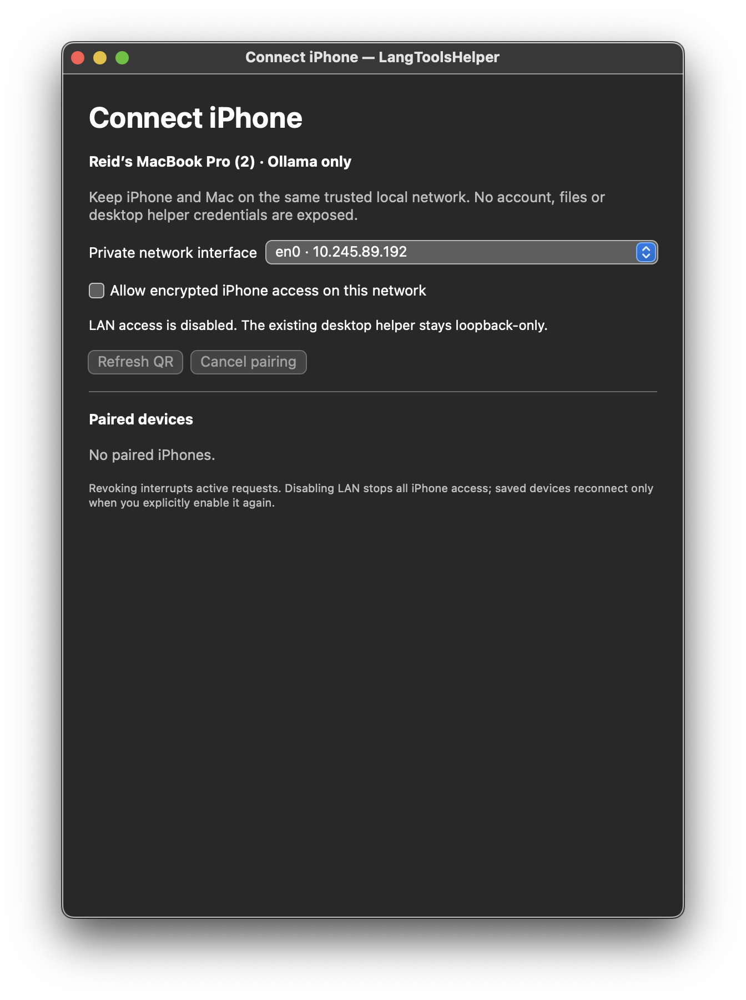
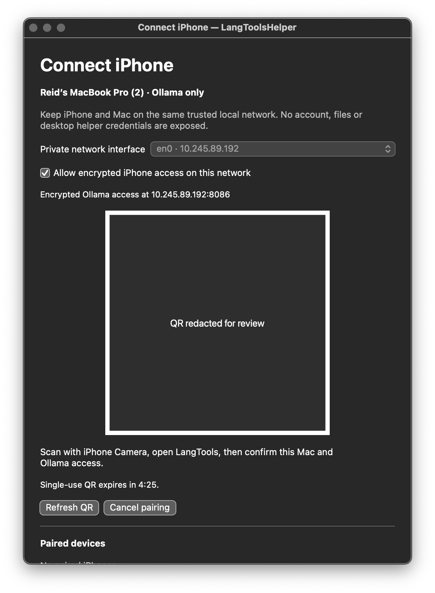
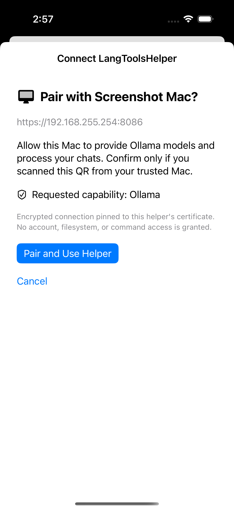
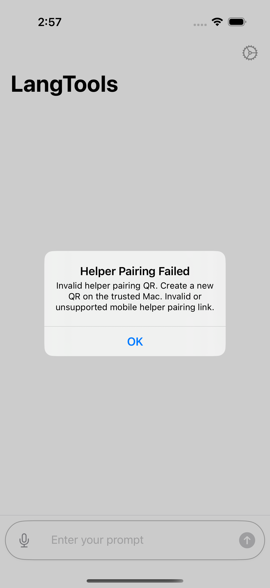
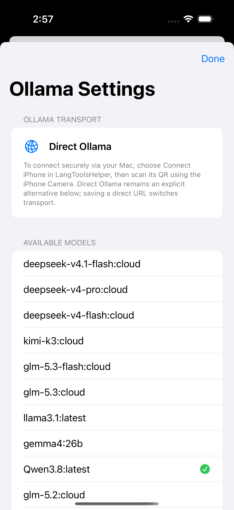

# iPhone Ollama helper pairing — verification

This document records the original opt-in, encrypted Ollama LAN transport and its historical verification. Direct Ollama remains an explicit alternative; helper failures never downgrade to direct HTTP. Optional Codex and external Claude Code account capabilities are documented separately in [LAN account routing and verification](helper-lan-providers.md). See the [helper setup and security boundaries](../cli/README.md#iphone-ollama-pairing-opt-in-lan).

## Recorded verification

- Shared pairing contract: 6 tests passed.
- Helper mobile relay, token/pairing and QR lifecycle: 31 focused tests passed. Real TLS tests cover scoped authorization, revocation, incremental responses, disconnect, oversized records and downstream backpressure. The flooding test uses a separate send deadline, not merely the overall request lifetime.
- Root stream validation: post-merge full suite passed (370 tests, 5 skipped). The earlier focused Ollama follow-up passed 51 tests with 1 skipped. Chat/generate require a final `done: true`; pulls require a final `status: "success"`. Incomplete streams retain emitted content but throw before tool execution.
- App helper tests: 20 passed, including 5 real pinned-TLS provider tests. Wrong pins send no bearer request; redirects are not followed; clean truncated EOF throws, including before tool execution.
- Post-merge app verification: 86 focused tests passed, covering helper transport, endpoint/configuration routing, generation settings, model capabilities, and proxy catalog isolation. The previously Keychain-blocked unavailable-model regression now uses isolated dependencies and passes without exclusion.
- Post-merge helper verification: 14 mobile relay/lifecycle tests passed, including real TLS and downstream send-specific backpressure.
- Before upstream integration, signed iOS build and strict signature verification passed; simulator build and one production-UI smoke test passed. Macro validation remained enabled using the existing approved JSON.swift revision.
- Independent code and security reviews found no remaining code blockers after the pull-completion fix.

Post-merge checks retain upstream generation settings and authoritative proxy catalogs alongside captured helper credentials and effective agent-model routing. They do not constitute physical-iPhone acceptance or a completely green full application/CLI suite.

## Earlier review-fix verification

- Local runs of the new CI commands passed: root `swift test --jobs 2` executed 370 tests (5 skipped, no failures); helper relay/lifecycle executed 14 (no skips/failures); focused app transport, routing, generation and proxy-isolation executed 100 (no skips/failures).
- Five deterministic access-state regressions verify that queued refreshes cannot restore an old server/helper catalog, including endpoint revision changes and same-endpoint refresh ordering. Four load/pull regressions distinguish recorded pin rejection from actual task cancellation.
- Thirteen real-TLS app tests passed, including production pairing redemption/authenticated health, persistence only after matching identity/capability, wrong-pin zero plaintext HTTP bytes, same/cross-origin redirect rejection, nonstream tags/chat, incremental streaming and incomplete EOF. Pairing maps trust diagnostics before invalidation releases the delegate.
- Bounded macOS CI jobs now run the separate helper/app packages serially, reject empty test runs and report skips. Local shell checks verified success, nonzero failure propagation and zero-test rejection; remote execution is separate from this local evidence.
- Independent code/security review found no new code findings in these fixes. This does not clear acceptance blockers.
- The Mac helper was rebuilt from the merged PR configuration; strict ad-hoc signature and bundle fixture-exclusion checks passed. Its current LAN-off/Keychain-denied UI was rendered and inspected. No active QR, token or private key appears in that screenshot.
- Clean detached-checkout iOS signed-build and simulator-UI attempts exited 65 at normal JSON macro validation, before tests (zero tests/screenshots). After synchronizing every approved source fix, the signed-build retry remained blocked. Final iOS signature/fixture checks and current iPhone screenshots therefore remain unverified.

## Session-lifetime and CI portability follow-up (current source)

- Root `swift test --jobs 2 --no-parallel` passed 373 tests (5 skips); helper mobile suites passed 14 (no skips); the CI-equivalent app filter passed 109 (no skips). All completed without failures.
- Twelve additional regressions cover session ownership: 3 root tests, 7 isolated app lifecycle tests and 2 real-TLS tests. Captured providers, snapshots, agent contexts, unconsumed streams and active requests keep their helper transport alive after selection changes. Successful stale/failed-save pairings retire without being selected; final lease release gracefully finishes tasks and invalidates the session.
- Retirement assertions observe lease/provider/delegate release and invalidation. Foundation may retain an invalidated raw session wrapper internally; its private wrapper lifetime is not a transport-ownership guarantee.
- The new stream regressions use explicit response/terminal gates, including a deliberate 1.4-second delay before ownership assertions. Nine focused regressions passed three consecutive serial runs after independent review corrected two scheduling-sensitive test assumptions.
- Remote run `37716378991` passed helper 14/app 100 XCTest cases, but both jobs failed afterward because the hosted runner lacked `rg`. Four guard/report searches now use native `grep -E`; YAML/shell syntax and 14 success, empty-suite, failed-command and skip/report probes passed with `rg` absent. [Remote Swift run `37727387415`](https://github.com/rchatham/LangTools.swift/actions/runs/37727387415) at `2d688c88` passed helper 14/app 109 without failures or skips, including the guard/report steps. Root/build, extended, performance and Pi workflow checks passed; cloud smoke checks were skipped.
- Independent scoped code and security reviews found no remaining findings in this follow-up. These nonvisual changes do not resolve the existing authorization, current-iOS, physical-device or full-suite acceptance blockers below.

## Physical-device acceptance (2026-10-08)

- The owner reports verification of the Ollama LAN path on a physical iPhone, including pairing, reconnect, and revocation. This is user-reported acceptance, not an agent-executed test run.
- Other previously recorded checks, including helper shutdown, interface/IP changes, current screenshots, and complete whole-app/CLI verification, are not established by that report.

## Known verification blockers

- Physical-iPhone pairing, reconnect, and revocation are owner-verified (see above). Helper shutdown, interface/IP changes, and the remaining detailed acceptance checks still need explicit verification.
- Full app testing encountered an external Ollama E2E timeout and then a legacy real-account Keychain access permission wait. No Keychain ACL bypass was used.
- Full CLI runs encountered existing Codex test failures/timeouts and a separately reproduced loopback-server restart connection-refused failure. The privileged loopback server was not changed for this feature.
- An earlier post-merge simulator run timed out compiling SwiftSyntax. Latest clean-config attempts fail promptly because Xcode requires normal approval of `JSONMacroPlugin` at immutable JSON.swift revision `f80d29f5113b5a3ed0a47e6afa908eab07ef024c`. Local approval currently covers the identical-tree 1.0.4 merge commit `498270c44bb80c5cf5b8de8727ceb030f95c0777`; Xcode treats revision fingerprints separately. No trust metadata, dependencies or validation settings were changed. Use Xcode's normal **Trust & Enable** confirmation for the reviewed resolved macro, then rerun build/UI checks. Current iPhone visual evidence remains blocked.
- The rebuilt helper needs normal login Keychain authorization for its existing mobile identity. Access was denied without entering a password or changing ACLs; LAN stayed off. Current LAN-on/QR evidence requires normal user authorization, not an automated permission bypass.
- Screenshots do not show a verified physically paired/connected or revoked phone, or the merged proxy-catalog state. Do not treat the feature as merge-ready until acceptance and visual verification are completed.

## Inspected visual evidence

Current rebuilt Mac helper after normal Keychain identity access was denied: LAN remains **off**, QR controls are disabled, and no paired state is claimed. The visible security error is blocker evidence, not successful pairing:

[Current Mac LAN-off/Keychain-denied screenshot](helper-ollama-screenshots/mac-current-keychain-denied.png)

The following Mac QR and iPhone screenshots are explicitly **pre-merge** evidence; do not infer current iOS acceptance from them. Actual Mac UI, with LAN opt-in disabled by default; active QR is fully redacted:

| LAN disabled | QR layout (redacted) |
|---|---|
|  |  |

Production app on iPhone 16 Pro simulator. The confirmation uses a synthetic, non-redeemable QR URL; no paired state is fabricated. Direct model discovery uses the Mac's loopback daemon, not physical-phone LAN:

| Confirmation | Invalid QR | Explicit direct alternative |
|---|---|---|
|  |  |  |

No live pairing code, reusable token or certificate private key is shown. Test certificate resources are confined to the app test target.
