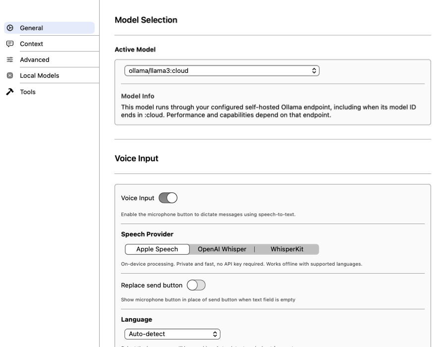
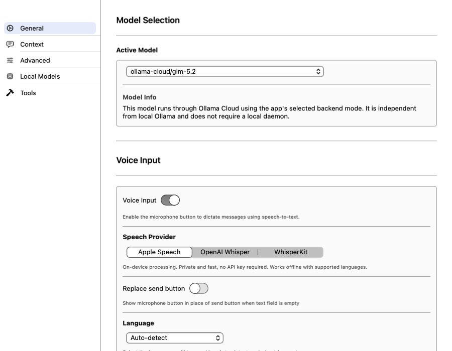

# Shared Ollama settings integration evidence

Actual public `ChatSettingsView` rendered in the Botsworth host with isolated synthetic fixtures. These images show only shared package views and fake/default model state—not private backend UI, real credentials, standalone LangTools transport, or live providers.

## Current macOS rendered evidence — 2026-10-08 source remediation

| Local daemon | Local `:cloud` ID | Distinct Cloud |
|---|---|---|
|  |  |  |

Captured and inspected against the repaired source before publication; subsequent asset/docs commits do not change runtime code. The local `ollama/…:cloud` identity remains local; Cloud is separate. These are synthetic NSHostingView rendered states, not interactive macOS workflows.

- Child focused regressions: **71 tests, 0 failures**, including persisted/external endpoint validation, cache/currentness, helper authority/leases, settings preservation and native fixture transport.
- Provider root: **375 tests, 0 failures** (5 skipped); callback routing preserves intermediate tool responses.
- Host focused integration: **139 tests, 0 failures**; macOS render/probe harness separately **6/6** with verified app/native interception and zero unexpected intercepted requests.
- Host execution used `env -i`, isolated HOME/CFFIXED_USER_HOME, empty CWD, verified Security-deny interposer and network-deny sandbox. Denied Keychain attempts are not absence of all Keychain activity. The existing real-Keychain roundtrip is retained but excluded from the 71-test scope after guard denial; full Chat/account/helper suite success is not claimed. No socket/live TLS proof.
- Actual current app-target Debug/Release and simulator verification are **blocked before app compilation** by Xcode's nested manifest sandbox (`sandbox_apply: Operation not permitted`). Package compilation is not app-target proof. Removing the additional build sandbox has not been authorized/performed.

## Historical iOS evidence — not current source verification

| Compact iOS (pre-merge) | Large iOS (pre-merge) |
|---|---|
|  |  |

These files remain pre-merge captures. Historical native fixtures passed 12 cases per viewport; a later startup correction passed three affected compact flows without a full rerun. Upstream settings/helper UI changed afterward. Fresh repaired-head compact/large inspection and screenshots remain a merge-readiness blocker; unchanged files do not prove visual equivalence.

Standalone Chat refuses Cloud completion/stream/agents without a host Cloud-capable transport; Botsworth supplies that integration in draft MR !14. Snapshot exposes no direct raw helper credential/lease/session getter, but returned `AgentContext` retains normal `LangTools` semantics: trusted holders can access its session and prepared requests. This is not a transitive secrecy sandbox.

Do not use real host stores/providers to force green tests. Simulator fixtures use fake credentials in owned devices; never inject the host deny interposer into simulator apps. No current Release fixture-exclusion, live-provider/deployed-TLS, complete UI verification or merge-readiness claim.
