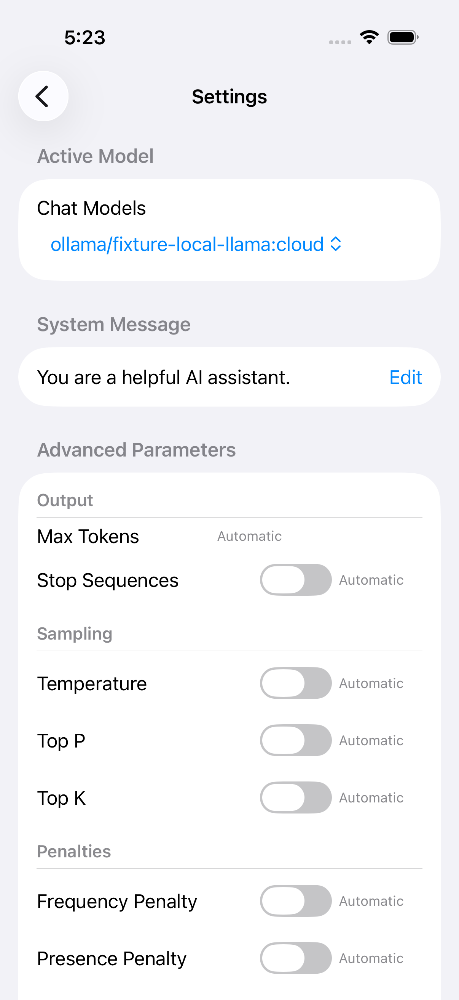
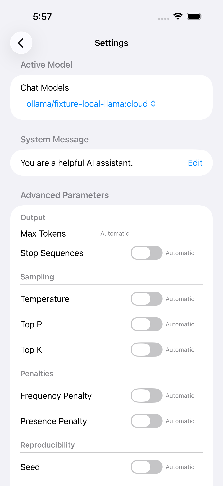

# Shared Ollama settings integration evidence

Actual public `ChatSettingsView` rendered in the Botsworth host with isolated synthetic fixtures. These images show only the shared package views and fake/default model state—not private backend UI, real credentials, standalone LangTools transport, or live providers.

| Compact iOS | Large iOS | macOS rendered state |
|---|---|---|
|  |  |  |

The local `ollama/…:cloud` identity remains local; Cloud is separate. iOS generation switches retain full labels and 44-point minimum rows; macOS controls remain platform-specific.

- Host native UI fixtures: 12 cases passed on each viewport. A later startup error-retention correction passed three affected compact flows; the full suites were not repeated after that non-layout correction.
- Child focused tests: 66 passed under scrubbed environment, isolated preferences and a verified host Security-deny interposer. Broad account/helper tests are not green under intentional credential denial.
- Host macOS: six opt-in actual-view capture/probe tests passed with explicit app and native Loopback fail-closed transport. These are rendered states, not interactive macOS workflows.
- Standalone Chat intentionally refuses Cloud stream/agent requests without a host Cloud-capable transport. Botsworth supplies that integration in draft MR !14.

Do not run tests against real host Keychain/preferences or providers. Simulator fixtures use only fake credentials in owned isolated devices; never inject the host deny interposer into those simulator apps. Release excludes the DEBUG transport seams. No merge-readiness or live TLS/E2E claim.
