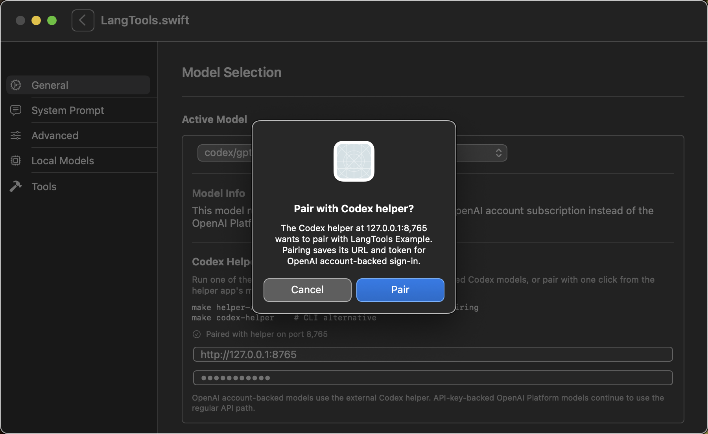
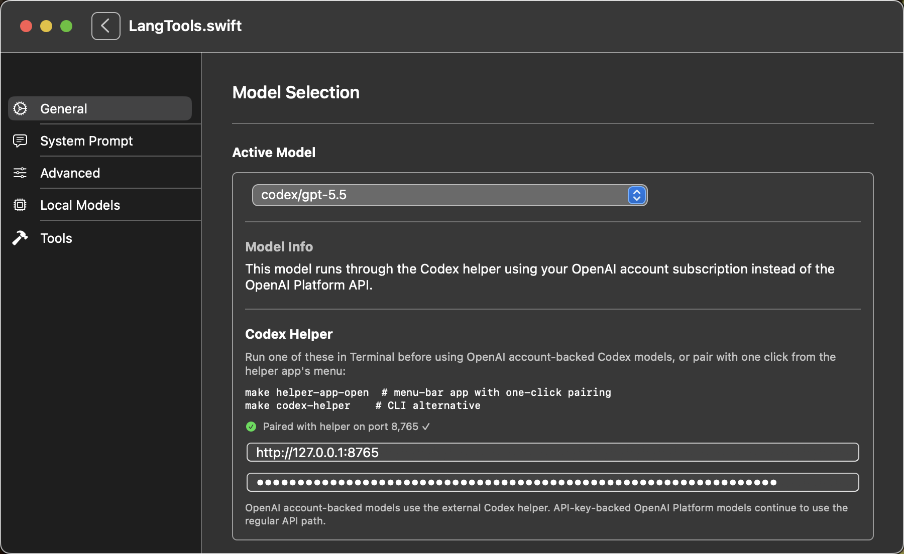

# PR #57 visual verification

| Pairing confirmation | Verified Settings state |
|---|---|
|  |  |

The helper menu was verified through macOS accessibility with these entries:

- `Running at http://127.0.0.1:8765`
- `Stop Helper`
- `Pair with LangTools Example…`
- `Copy Token`
- `Quit LangTools Helper`

A menu screenshot could not be captured because the helper status item was placed outside the visible menu-bar region in the capture environment. Its **Pair with LangTools Example…** action was invoked through accessibility to produce the pairing-confirmation and verified-state screenshots above.
