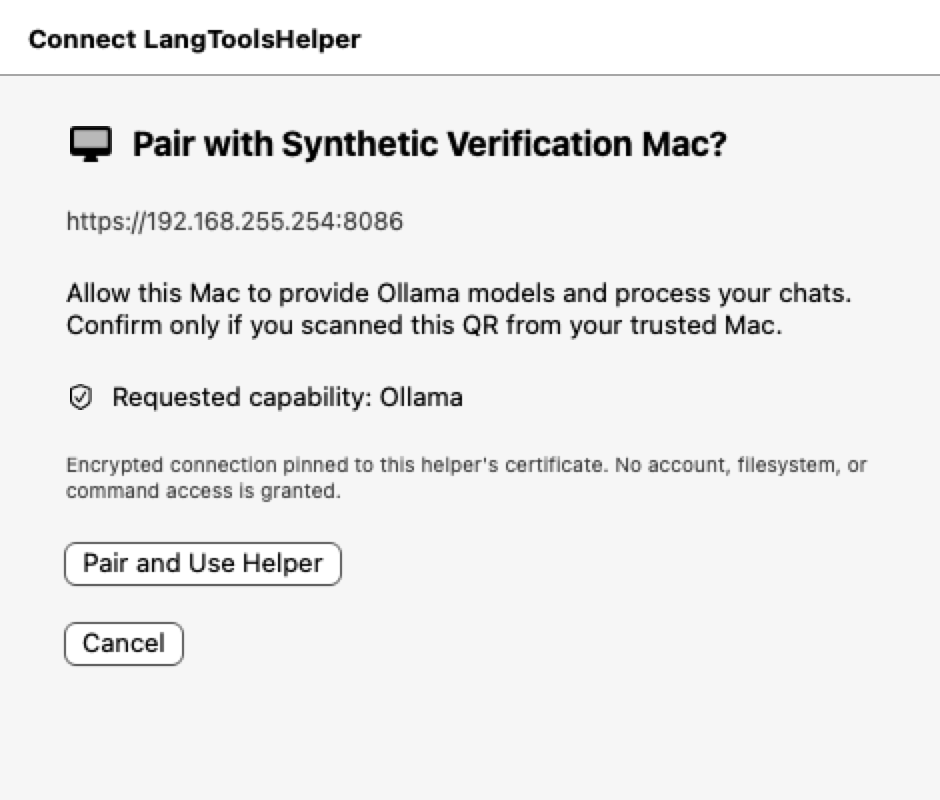
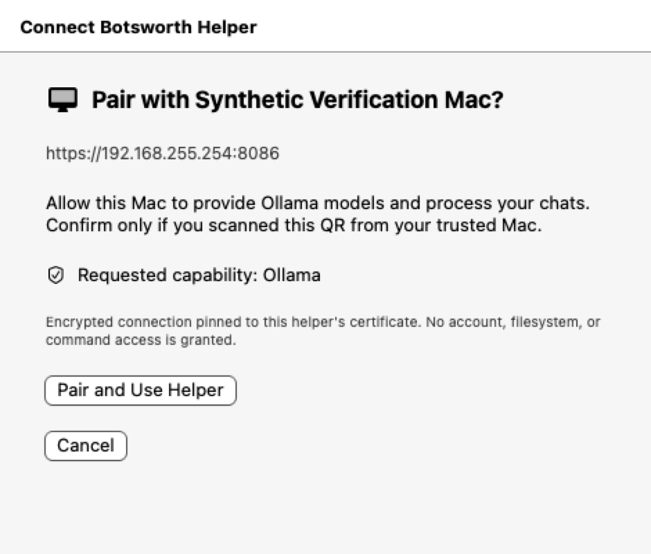
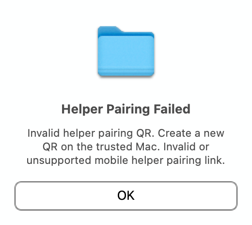

# Public helper API presentation verification

Current production SwiftUI pairing modifier rendered and inspected on macOS 15.6, 2026-10-09. The AppKit fixture hosts a real attached sheet, not a replica of the pairing UI.

| Default title | Custom title | Invalid link |
|---|---|---|
|  |  |  |

The titles, synthetic Mac identity/endpoint, complete consent/capability/security text and confirmation/Cancel controls are readable without clipping. Only the production Cancel button is pressed. The invalid-link alert is dismissed without pairing. Three tests verify sheet attachment, accessibility content, dismissal, unchanged configuration and zero selection callbacks.

```bash
MOBILE_HELPER_PRESENTATION_ARTIFACTS=/tmp/botsworth-phase1/presentation \
  swift test --package-path Apps/LangTools --jobs 4 --no-parallel \
  --filter MobileHelperPairingPresentationTests
```

Artifact-enabled and artifact-disabled runs each passed 3 tests, exit 0. The final combined helper/configuration/lifetime/TLS/presentation run passed 52 tests, exit 0. Logs: `/tmp/botsworth-phase1/{presentation-tests,presentation-no-artifacts,public-api-final-client}.log`.

## Boundaries

- Synthetic, non-redeemable payloads only; fresh UUID defaults suites and custom credential namespaces. An inherited selection is rejected before construction. No confirmation, Keychain I/O, network request or listener occurs.
- Default-title evidence uses an injected coordinator; the legacy no-argument `.shared` wiring is compile-checked and code-reviewed, not exercised at runtime.
- Images are attached-sheet content-view layer bitmaps at 2× with Aqua appearance and the actual window background color beneath compositor-backed materials. They are not full screen/compositor captures; shadow, material vibrancy and active-window accent fidelity are not verified. The alert's icon belongs to the test process, not a packaged application.
- The in-process accessibility hierarchy is enabled like the existing ChatUI harness. No cross-process accessibility or screenshot-permission changes are used.
- macOS 14 runtime, current iOS rendering and physical-device pairing remain unverified. Existing CI's `MobileHelper` filter includes these AppKit tests; hosted-runner and subsequent-test isolation must be checked before readiness.
