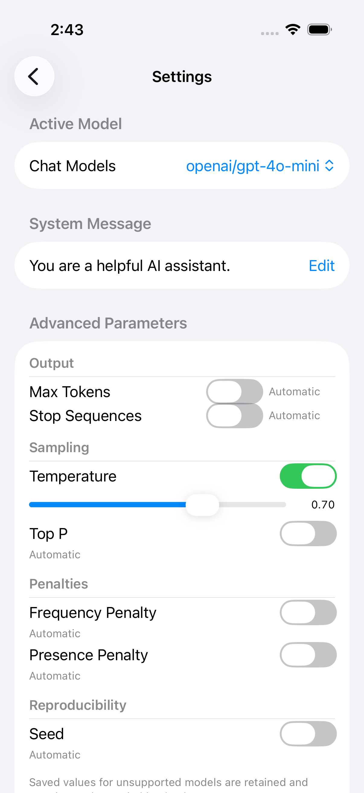
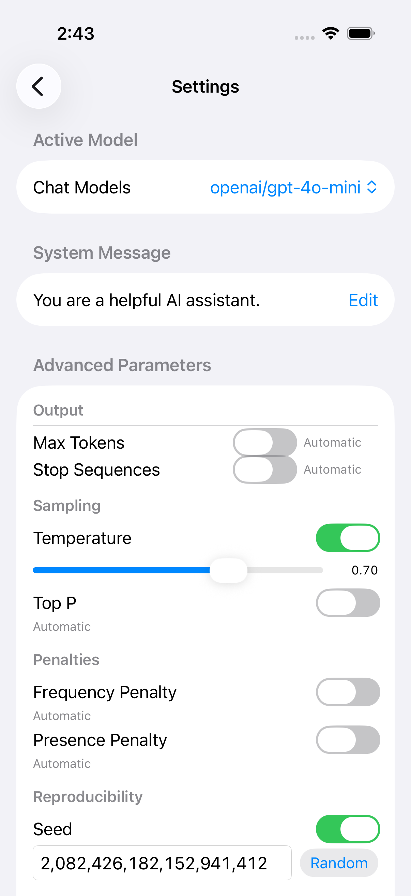
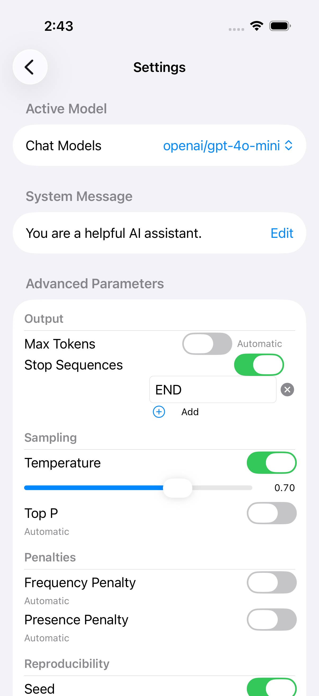
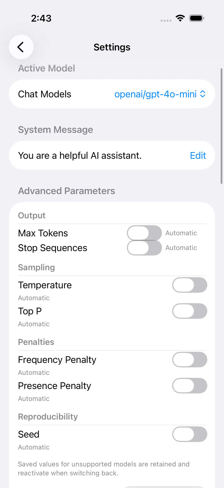
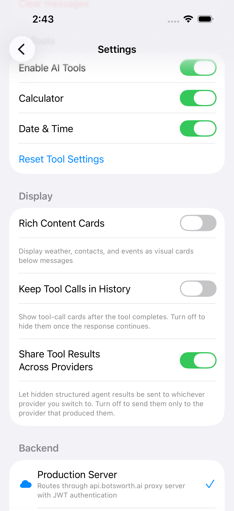

# Non-macOS checkbox-style content recovery

`checkboxToggleStyle()` must retain its original view on non-macOS platforms. The
missing `#else self` in published SDK `cc38d5b` made the ViewBuilder return EmptyView
on iOS, hiding controls including Stop Sequences. The fix leaves macOS checkbox
styling unchanged and preserves native platform styling elsewhere.

## Source and verification

- SDK fix: `56c1ca8`, based on merged PR73 `cc38d5b`.
- Consumer: Botsworth MR19, `001e41a` plus the exact app/project changes committed
  as `b48c2d1`. Its nested SDK was `cc38d5b` plus the same two-line helper change.
- User-approved local consumer JSON clone: version 1.0.4, `498270c`; SDK manifests
  remain remote. This was not a pristine published consumer dependency graph.
- macOS isolated XCTest: checkbox-content regression plus Stop editor tests,
  **17 passed, exit 0**. The non-macOS-specific type test is conditionally compiled
  and was not executed by the macOS run.
- iOS native: fresh Debug fixture build, exact bundle/signatures/device/source
  validation, untouched Xcode-generated `UseUITargetAppProvidedByTests` descriptor
  with the actual `.app` dependency. **Six scenarios passed, exit 0**, with unchanged
  original control/persistence/reset assertions. Source hashes were unchanged.
- Owned simulator: `240415B2-B34B-40D5-B040-EFF598289F73`, iPhone 17 Pro; shut down
  after this run. Exact fixture bundle:
  `com.reidchatham.botsworth.proxy-discovery-fixture`.
- Run: `native-provided-app-20261008T221835Z`. Failed attempts retained separately,
  including malformed target-app metadata and the 5-pass/1-fail missing-Stop run.
- No ordinary app launch, live provider/account probe, real agents/tools,
  microphone/speech activity or macro trust/bypass changes.

## Inspected fixture-app captures

An image-capable reviewer inspected all six PNGs. These are byte copies of owned
fixture-app attachments, not desktop captures; hashes, timestamps, dimensions
and test names are recorded in [manifest.json](manifest.json).

| Temperature | Long randomized seed | Stop END |
|---|---|---|
|  |  |  |

| Reopened | Reset | Tools/display |
|---|---|---|
|  |  |  |

Temperature 0.70 uses range 0–2, so its slider is at 35% of the track. The Seed
capture shows a fully readable randomized 19-digit value, not a maximum-Int64
specific screenshot. END and reopen captures are byte-identical; persistence
is established by test assertions, not by a visually distinct screenshot.

These shared-view renders come from the Botsworth iOS fixture app. Earlier
LangTools macOS fixtures remain historical evidence; this fix's macOS branch is
unchanged. Final published dependency-graph gates belong to MR19 after upstream
publication, and are not inferred from this local-fix run.
