# PR73 native macOS settings evidence

These three inspected PNGs show the macOS UI fixture window only (1800 × 1104 each). They cover Advanced parameters and Tools, including display-related controls within Tools—not a separate Display tab.

| Advanced parameters | Tools execution and display | Tools defaults |
| --- | --- | --- |
| 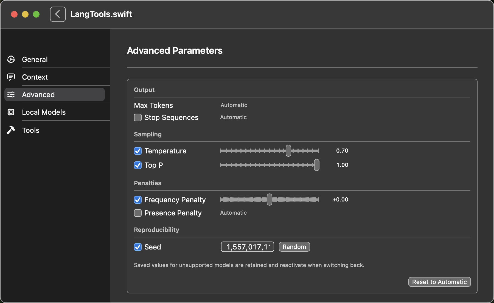 | 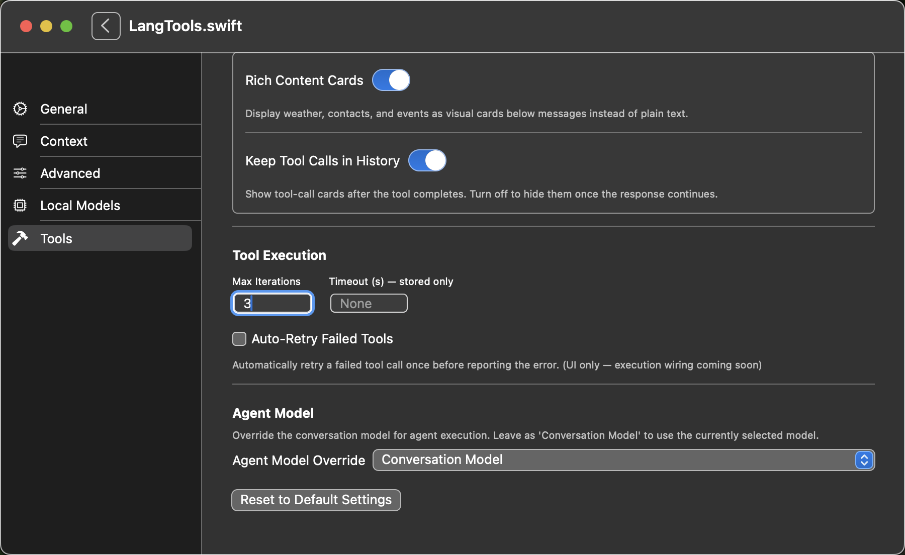 | 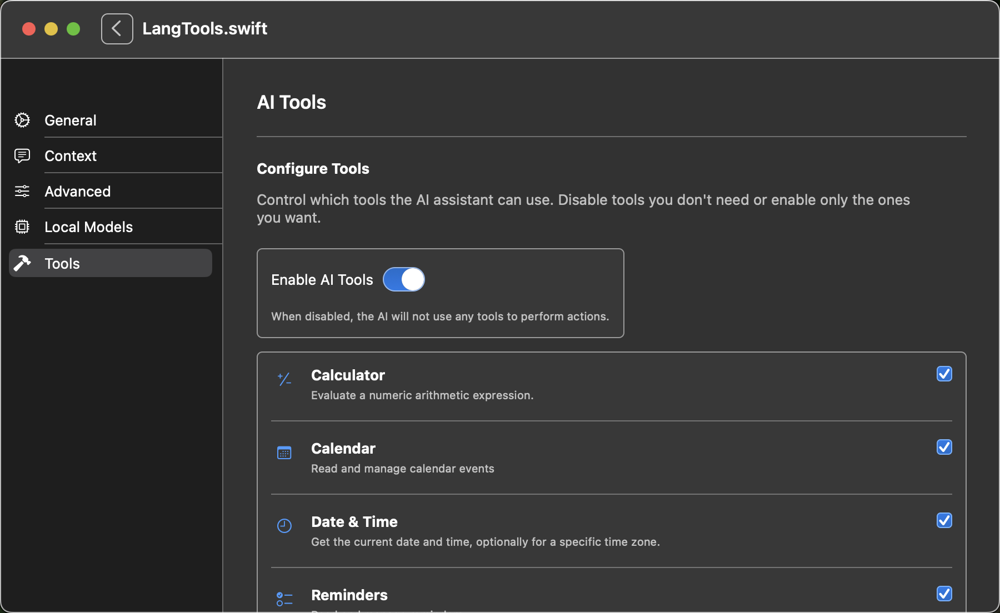 |

## Capture provenance and recorded results

- Capture run: `mac-ui-20261007T182126-matrix-off`, 2026-10-07, at HEAD `ca7efba` with fixture changes uncommitted. The fixture app and shared-settings changes were subsequently published in `63ce8efb87940d30b0f8243d61e5754f0b5d61df`. That commit also includes the later window-only launch-capture guard, separately verified by the three-test `mac-ui-window-only-20261007T182926` run. These earlier settings captures did not test the later Stop-editor fix.
- Exact exported window attachments copied without alteration from `review-images/advanced_params_active.png`, `review-images/tool_settings_active.png`, and `review-images/tool_settings_default.png`, respectively. Desktop/Launch Screen attachments and raw logs are excluded.
- Recorded macOS UI result: **3 tests passed, 0 failures, 0 skipped; actual exit 0** (`testAdvancedGenerationSettingsScreenshots`, `testToolSettingsScreenshots`, and `LangToolsAppUITestsLaunchTests/testLaunch`). Build-for-testing also exited 0. The macOS launch appearance matrix was disabled; the earlier matrix-enabled run failed and is not counted as a pass.
- Only the dedicated fixture app `com.reidchatham.LangTools-Example-UIFixture` was launched, after generated Info.plist, xctestrun and source mapping inspection. Ordinary LangToolsApp **Debug and Release compilation** succeeded (exit 0); normal apps were **not launched**.
- Canonical SDK builds used remote `JSON.swift @ 1.0.4`, checkout `498270c44bb80c5cf5b8de8727ceb030f95c0777`, and the normal `JSONMacroPlugin` graph. No local JSON substitution, macro-validation bypass or trust-store writes were used.
- Fixture isolation was source-audited: unique credential service and defaults namespace, fixture-only reset, mock requests/empty agents, guarded audio lifetime/actions/getters and live-client paths, and suppressed account/pairing/redirect paths. This is **not a comprehensive dynamic privacy audit**; startup network and microphone activity were not instrumented.

## Current Stop-editor regression evidence

The updated shared editor was verified by `mac-stop-native-20261008T022051Z` on 2026-10-08 UTC (2026-10-07 local). Build-for-testing and all **3 macOS UI tests passed, actual exits 0**. The Advanced test requires blank focus without losing the row, exact `END`, clear/retype, Back-navigation and settings reopen without app relaunch, persisted `END`, and Reset to Automatic with no row/Add control. Checkbox assertions normalize numeric/string accessibility representations to exact 0/1. Earlier failed harness runs are retained, not counted as successes.

These fresh, unaltered 1800 × 1104 fixture-window captures were inspected before publication:

| Focused blank draft | Cleared and retyped `END` | Reopened settings | Reset to Automatic |
| --- | --- | --- | --- |
| 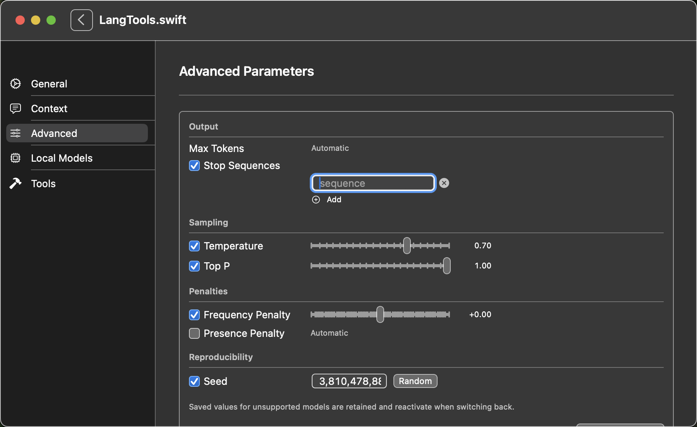 | 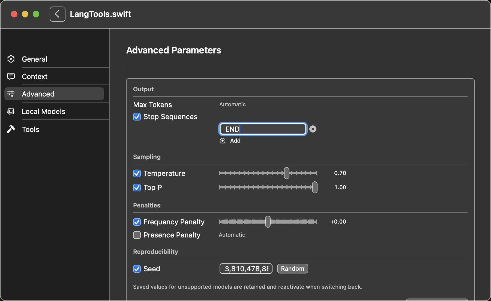 | 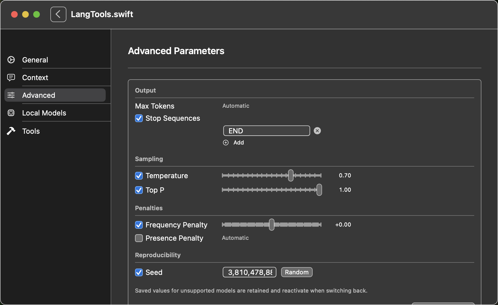 | 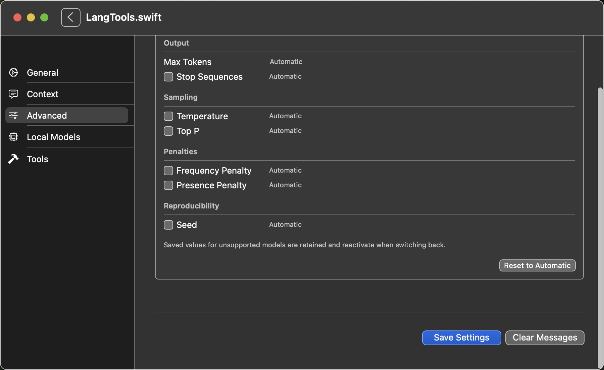 |

The run used the exact isolated bundle and normal remote JSON revision above. Current ordinary `LangToolsApp` Release compilation also passed (actual exit 0, 267.4 seconds); its normal bundle was verified and never launched. No compile timeout or retry occurred. The implementation was uncommitted on top of `63ce8ef` during this run: Stop view SHA-256 `056030dc2e52c36b4921692e89bb1531b44e2da2039ffde24843f5c30bf38032`; focused unit-test source `f3f9ef12f8898ce40bae0059df328416ffa644e38059b55d7d3aab3377c8d0ee`. Fresh unit results were **16 focused**, **342 offline Chat** (live Ollama excluded), root **338 with 5 skipped**, and policy/audio **25**, all final exits 0. An initial offline run failed an unchanged Keychain session-removal test with OSStatus −99999; its exact-source rerun passed, with no auth/environment workaround and no proven cause.

## Exact macOS UI commands used

Run from the canonical SDK root. `RUN` denotes the capture run's artifact directory; these are recorded commands, not new executions performed to add this document. The identity override is app-specific (`LANGTOOLS_APP_BUNDLE_IDENTIFIER`), never a global `PRODUCT_BUNDLE_IDENTIFIER` override.

```sh
xcodebuild -project Apps/LangTools/LangTools.xcodeproj \
  -scheme LangToolsAppUITests -configuration Debug -destination platform=macOS \
  -jobs 2 -parallel-testing-enabled NO -only-testing:LangToolsAppUITests \
  -disableAutomaticPackageResolution -onlyUsePackageVersionsFromResolvedFile \
  LANGTOOLS_APP_BUNDLE_IDENTIFIER=com.reidchatham.LangTools-Example-UIFixture \
  CODE_SIGN_IDENTITY=- build-for-testing
```

After explicit generated Info.plist/xctestrun/source inspection:

```sh
xcodebuild -project Apps/LangTools/LangTools.xcodeproj \
  -scheme LangToolsAppUITests -configuration Debug -destination platform=macOS \
  -jobs 2 -parallel-testing-enabled NO -only-testing:LangToolsAppUITests \
  -disableAutomaticPackageResolution -onlyUsePackageVersionsFromResolvedFile \
  LANGTOOLS_APP_BUNDLE_IDENTIFIER=com.reidchatham.LangTools-Example-UIFixture \
  CODE_SIGN_IDENTITY=- \
  -resultBundlePath "$RUN/native-ui.xcresult" test-without-building
```

## Current iOS layout verification (canonical b079258)

The approved iOS-only layout (`b079258`) separates each switch/title into its own row with full-width slider/stepper/seed controls below; macOS/other-platform source is byte-identical, and control IDs/ranges/capability semantics are unchanged. It was verified end-to-end through the Botsworth consumer fixture app (which renders this shared view) at `native-canonical-20261008T051936Z-vwbodk49`: `xcodebuild test-without-building` exit 0, **all six scenarios passed / 0 failed / 0 skipped** on the exact fixture bundle and owned iPhone 17 Pro simulator, with read-only prelaunch identity/signature/source checks. Fixture startup isolation suppressed real agents and microphone/speech permission requests; no live provider, tool execution or desktop capture was involved. These are Botsworth fixture-app simulator captures (1206 × 2622) with synthetic data only, inspected by the image-capable verification worker; they verify the approved local-JSON consumer graph plus this published SDK, not a normally published consumer dependency graph.

| ### Temperature vertical row (0.70) | ### Long Seed fully readable | ### END stop sequence |
| --- | --- | --- |
| 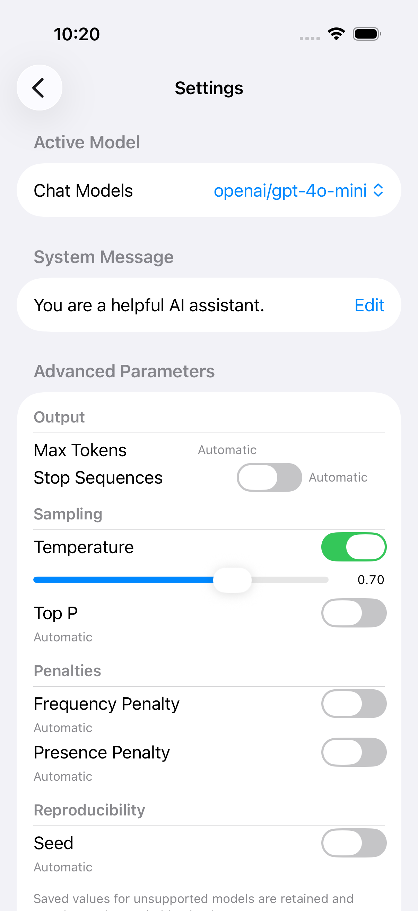 | 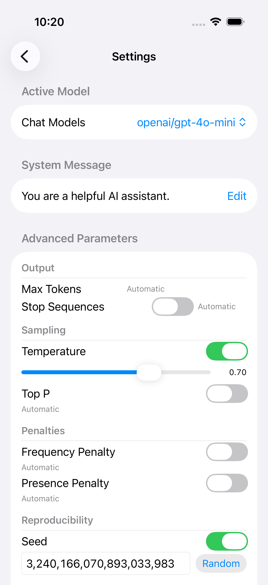 | 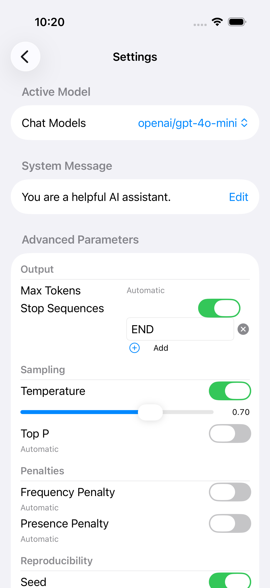 |

| ### END persisted after reopen | ### Reset to Automatic | ### Tools/Display after reopen |
| --- | --- | --- |
|  | 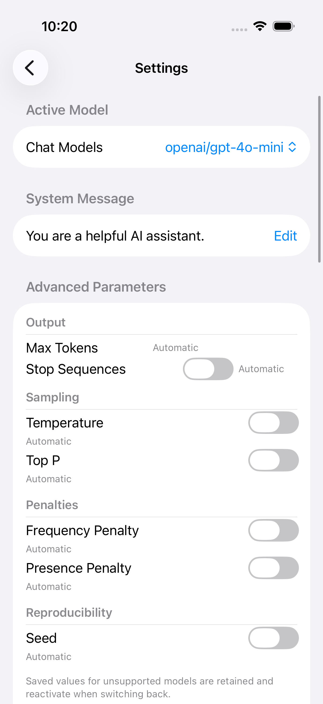 | 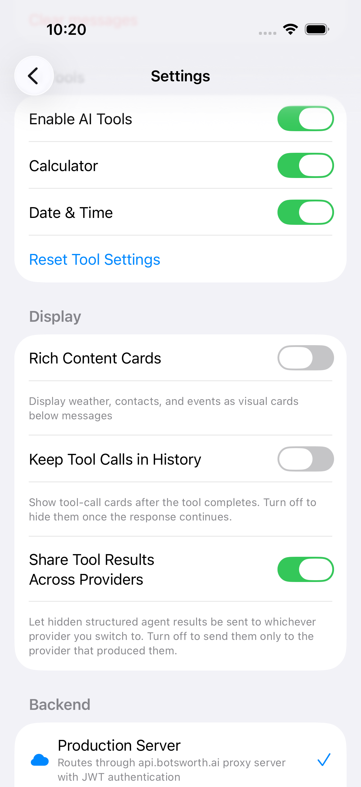 |

The previously reported Temperature-switch/label overlap and long-Seed truncation are fixed in these states. Enabled penalty-slider values, other devices/viewports/themes were not exercised. Backend macOS matching-pin verification passed 66 tests on this exact published graph; the current Backend Linux run remains a separate consumer-side gate.

## Scope limits

The first three captures are historical settings evidence; the separate four-image table verifies the current Mac Stop editor at `1be7de7`, and the iOS tables verify the `b079258` layout through the consumer fixture app. Neither establishes General settings, live provider/tool execution, or a dynamic privacy audit. Ordinary App Release verification is tracked separately from Debug UI success. This document does not declare PR73 or its consumer merge-ready; published artifact links belong in the PR description/comments.

## Image integrity (SHA-256)

All copies are byte-identical to the approved sources; all dimensions are 1800 × 1104.

| File | SHA-256 |
| --- | --- |
| `images/advanced-parameters.png` | `9c0957c9c351ab6185354b4efb2386d5d0bb8939ce51e9710f77934a5e84bc5b` |
| `images/tools-execution-display.png` | `aeb1a99fa7ce37f2967564adf5d4b8730dd09d7c48af40142805c6c4bed69c3b` |
| `images/tools-default.png` | `28e2dd2ee4d3833fd2fa73209ee8ca08bd2c353517b5f6600247c243f266f67e` |
| `images/stop-blank-focused.png` | `61a9fd17bff8329af8d788141c5170bd68869863435da4525064755fe876bdbd` |
| `images/stop-retyped.png` | `41e389a7bd9c49d0c1052997915ad538f2c97f5b39cb84e0f37dbca2550e4bfe` |
| `images/stop-reopened.png` | `3b5a95ca10a77301cbbc70916de098ff2c7acad8c9c9fcf4ed8b9419a2d337b8` |
| `images/stop-reset-automatic.png` | `62d32d873de64b09e29c968d7795761deaee7a3fbd1bcb9bb0e58dcdf37416d7` |
| `images/ios-temperature-enabled.png` | `20555caf388b77796ce5fbbb280f1f8f1d0016f749d6bc6b8d86a04d03cb55f9` |
| `images/ios-seed-long-value.png` | `12cd406d269925cb318a1d067f6613e2d418394f51e35b2d12b8f03349c72b77` |
| `images/ios-stop-sequence-end.png` | `2c50e002df1e06e1ce5b97ae69b4a1eb956c319210d159314c0b70772d3e36d5` |
| `images/ios-stop-persisted-reopen.png` | `2c50e002df1e06e1ce5b97ae69b4a1eb956c319210d159314c0b70772d3e36d5` |
| `images/ios-reset-automatic.png` | `c39cad3ffad042fd25e4518bce80942c95de717b698cc3f45c3ed82007d059b1` |
| `images/ios-tools-display-persisted.png` | `b61d794e0609ffba954621350dc6b6632db402ee5c91e95e5a3ea95e9b03aa7f` |

The iOS captures are byte-identical to the verified xcresult attachments (state-named manifest cross-checked); all dimensions are 1206 × 2622.
